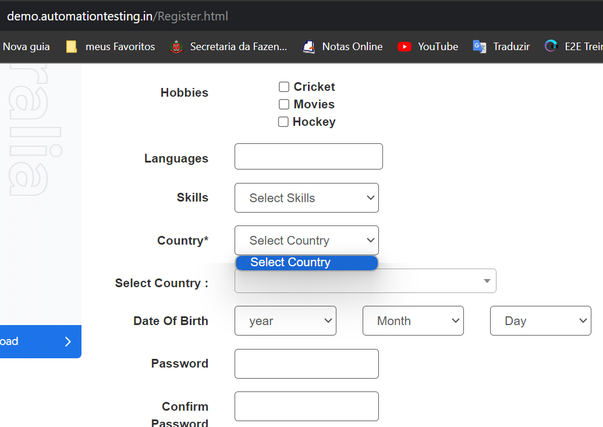

Desafio Automação | MJV
________________________________________________
É um prazer tê-lo em nosso processo seletivo, esperamos que você venha compor o
nosso time, agregar muitos conhecimentos e desfrutar de uma experiência única em sua
carreira focada em qualidade, inovação e transformação digital. Este é nosso teste para dar continuidade em seu processo seletivo, onde esperamos que
automatize um cenário Web e um de API com o framework de sua preferência, no final
aguardamos um projeto com instruções que utilizou para desenvolver o cenário. ● Tecnologias:
○ Para a escrita dos cenários solicitados seguindo BDD: Cucumber;
○ Linguagem de programação: Qualquer uma de seu domínio(ex.: Javascript, Ruby ou Python)
○ Frameworks: Qualquer um de seu domínio(Selenium, Cypress e etc)
● Desafio web:
○ Criar os cenários abaixo para o seguinte site: Automation Practice
“https://demo.automationtesting.in/Register.html” ■ Preencher todos os campos obrigatórios do formulário
■ Upload da imagem

■ Submeter o formulário com os dados preenchidos. ● Desafio API:
○ Enviar um GET para API
■ “https://api.trello.com/1/actions/592f11060f95a3d3d46a987a” e exibir o
conteúdo do campo “name” da estrutura “list”. Validar o status code da

resposta do serviço. Ao concluir o teste, nos encaminhe o Link do GITHUB/ GITLAB ou do BITBUCKET
para que possamos acessar.

#Criterios de aceite#
Cenario de teste:
-visitar site “https://demo.automationtesting.in/Register.html” 
-Preeencher Formulario com campos obrigatorios:
CT 01 Full Name* preencher campo First name e Last name;
CT 02 Address não obrigatorio mas preenchido
CT 03 Email address*
CT 04 Phone* BUG encontrado não aceita numeral informado, retorna "Faça corresponder o formato pedido" 
CT 05 Gender* click em MALE
CT 06 Country* BUG encontrado não abre aba com país 
CT 07 Password "PREENCHER" senha123
CT 08 Confirm Password senha123
CT 09 Clicar botão Submit
CT 10 Screenshots

# Desafio com framework Cypress #

Terminal usar comando "npx cypress open" para abrir o cypress
Escolher opção E2E TEST RODAR A AUTOMAÇÃO

